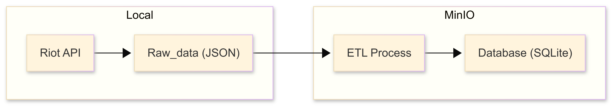

# Report 2: Data Pipeline

## 1. Overview

- Objective: <!-- e.g., Build an end-to-end data pipeline -->Build an system that can collect TFT's matchs histories
- Scope: <!-- e.g., From crawling → storage → database --> Crawling (RIOT API) -> Storage (MinIO) -> Database (SQLite)
- Data source: <!-- API / website / dataset --> https://developer.riotgames.com/apis#tft-match-v1/GET_getMatchIdsByPUUID

---

## 2. System Architecture
### Pipeline Diagram

### Components Description
- **Raw Data (JSON)**: Contains match data with nested participant and unit information

- **ETL Script**: Extracts, transforms, and detects carry units
- **Database (SQLite)**: Stores structured data in normalized form

---

## 3. Data Ingestion

### Description
> Data is read directly from local JSON files matching a specific pattern.

### Input Source
- File pattern: `data/raw/tft_raw_top150_*.json`
- Data type: Nested JSON

### Processing Logic
- Iterate through all JSON files
- Extract:
  - `match_id`
  - `puuid`
  - `placement`
  - `level`
  - `units` (list of champions)
## 4. Data Preprocessing
### Deduplication
Remove duplication based on match_id and puuid
## 5. Carry Detection Logic

### Description
Identify "carry" units using predefined rules.

### Steps
1. Load configuration:
   - Champion mapping
   - Item roles
   - Components

2. For each unit:
   - Apply `is_unit_carry()` function

3. Extract:
   - `carry_name`
   - `carry_tier`
   - `carry_cost`

### Output
- Only rows containing at least one carry are kept
- Rows without carries are skipped
## 6. Conclusion

The ETL pipeline successfully implements a complete data processing workflow:

- Reads raw JSON data from local storage
- Extracts and transforms nested participant and unit information
- Applies domain-specific business logic (carry detection)
- Loads structured data into a normalized SQLite database (3NF)

Overall, this pipeline demonstrates an end-to-end transformation process, converting raw, semi-structured data into a clean and queryable relational format suitable for further analysis.