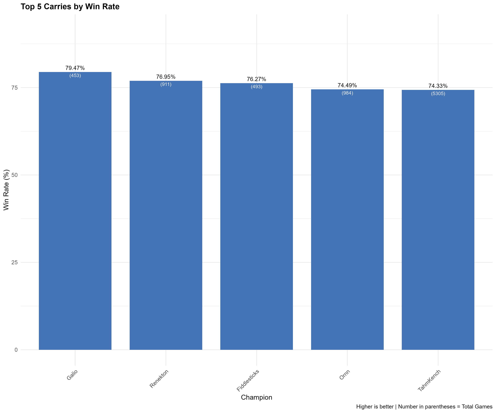
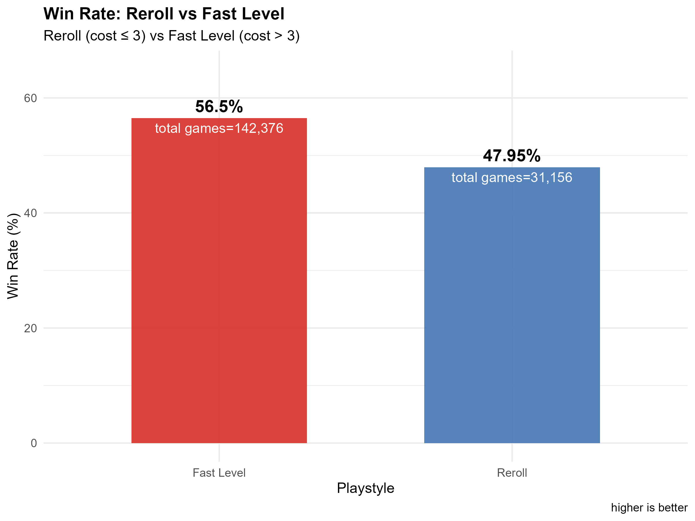
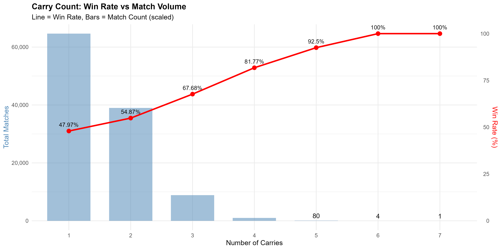

# Exploratory Data Analysis Report

## 1. Introduction

### 1.1 Background
Describe the context of the analysis.

- The dataset include TFT matches's history collected using RIOT's API
- This analysis can be using to understand one of entity that lead to victories: Carry champion
- This could help newbie can approach the contents of the game more easily
---

### 1.2 Research Questions

This report aims to answer the following questions:

1. **Question 1:**  
   Top 5 carry champion who have the highest winrate?

2. **Question 2:**  
   Which playstyle that have higher winrate? Reroll or Fastlevel?

3. **Question 3:**  
   Is the number of carries impact on the game result?

---

# 2. Dataset Description

### 2.1 Data Source

Describe where the dataset comes from.

- Dataset name: tft_data
- Storage format: JSON
- Database system: SQLite
- Data collection method: Using RIOT's API

---

### 2.2 Data Structure

Describe the structure of the dataset.

| Column Name | Description |
|-------------|-------------|
| puuid | The user's ID |
| match_id | the id of collected match |
| placement | result of the game |
| level | the level of the player in that match |
|carry_name|the name of the carry
|carry_tier|the star (tier) that the carry have
|carry_cost|the cost of the carry champion

---

### 2.3 Dataset Size

Describe the scale of the dataset.

- Total matches: 21257
- Total players: 150
- Total records: 173,531

---

# 3. Methodology

### 3.1 Data Processing

Explain how the data was prepared.

Things to describe:

- Data cleaning: remove the dupplicate matches using match_id
- Champions will be filtered by their role and equiped items to find carry champion (There is a list of suitable items for each role)

### 3.2 Visualization Approach

Describe the visualization tools and methods used.

- Visualization library:
- Types of charts used:
  - Bar chart: for the comparision of champion or playstyle
  - Line chart: to see the growing of winrate
---

# 4. Analysis

---

## 4.1 Analysis for Question 1

### Objective
Show the top 5 champion that have the highest winrate

### Method

The data was grouped by carry_name to calculate performance statistics for each champion. The total number of games and the number of top-4 finishes (placement ≤ 4) were counted to compute the win rate. Champions with fewer than 50 games were excluded to ensure reliable results. The champions were then ranked by win rate, and the top five were selected

---

### Visualization

---

### Observations
Galio has the highest win rate (79.47%) but appears in relatively fewer games. Renekton and Fiddlesticks also show strong performance with win rates above 76%. Tahm Kench, while having a slightly lower win rate (74.33%), appears in the largest number of games (5305), suggesting it is a more commonly used and stable carry option.

---

## 4.2 Analysis for Question 2

### Objective

Find out which playstyle is better? Reroll (Roll until we have a tier 3 carry, ussually the carry which has carry cost <= 3>) or Fastlevel (try to level up fast in order to have more expensive carry, ussually the carry which has carry cost >=4)

---

### Method

This query analyzes the win rate of different playstyles based on carry cost.
Each record is classified into two playstyles: Reroll (carry cost ≤ 3) and Fast Level (carry cost > 3). Records with missing carry cost are excluded.

The query then counts the total number of games and the number of top-4 finishes (placement ≤ 4) for each playstyle. The win rate is calculated as the percentage of games that finished in the top 4. Finally, the results are sorted by win rate in descending order.

---

### Visualization

---

### Observations

We can see that the Fast Level playstyle have the higher winrate (more than 8.55%) and matches played (more than 111,220 matches)

---

## 4.3 Analysis for Question 3

### Objective

Find out that is the number of carries effect on the winrate

---

### Method

First, the number of carries used by each player in each match is counted by grouping records using puuid and match_id. The placement of the player is also recorded. A win is defined as finishing in the top 4 (placement ≤ 4).

Next, matches are grouped by the number of carries, and the total matches, total wins, and win rate are calculated. The win rate is computed as the percentage of matches where the player finished in the top 4. The results are then sorted by the number of carries.

---

### Visualization

---

### Observations

The higher number of carries, the higher of winrate

---

# 5. Key Insights

Summarize the most important findings from the analysis.

1. Insight 1: The champion which has the highest winrate is Galio, but the one which have highest winrate not the one which is most popular
2. Insight 2: The Fast Level playstyle has higher win rate and more popular because of the stability when it not depend too much on luck to roll for upgrade the carries to tier 3
3. Insight 3: The more carry you have, the more chance to win

