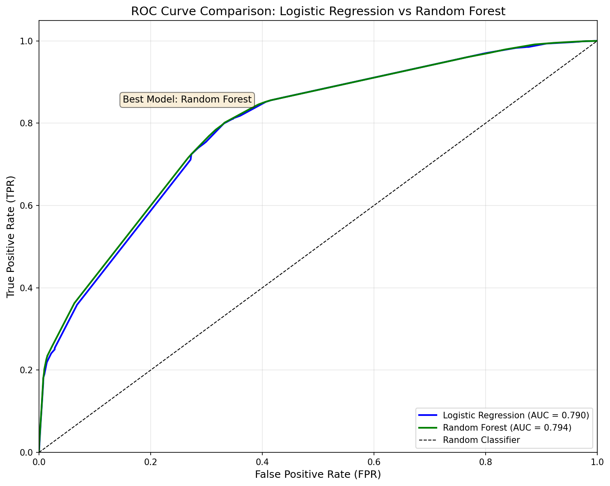
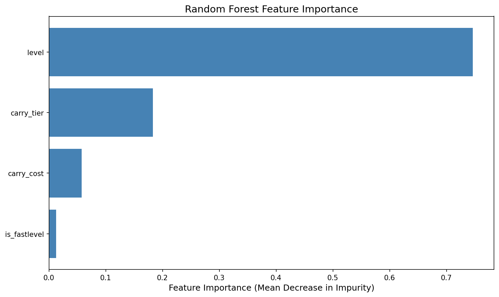
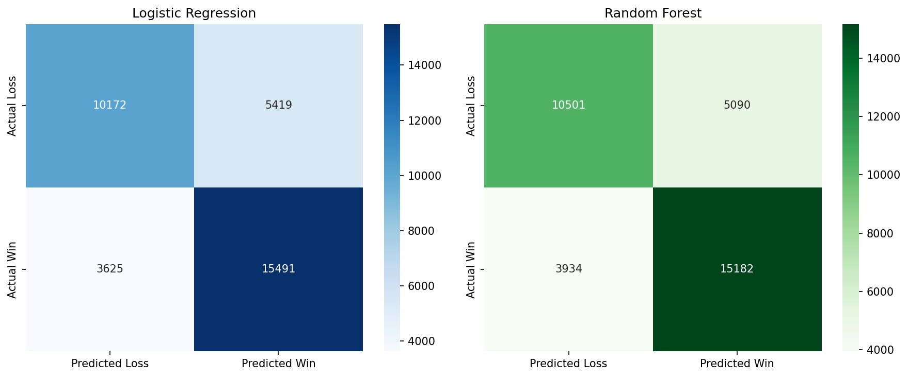

# Comparative Analysis of Logistic Regression and Random Forest for Teamfight Tactics Match Outcome Prediction
 
**Affiliation:** Course (ADY202)  
**Date:** March 2026

---

## Abstract

This report presents a comparative analysis of two machine learning classification algorithms—Logistic Regression and Random Forest—for predicting match outcomes in Teamfight Tactics (TFT), an auto-battler strategy game. Using a dataset of 173,532 player records from 20,849 matches, we evaluate model performance using accuracy, precision, recall, F1-score, and AUC-ROC metrics. Our results demonstrate that **Random Forest** achieves superior performance with an AUC-ROC of **0.7943**, outperforming the Logistic Regression baseline by **0.5%**. Additionally, feature importance analysis reveals that **level** is the most significant predictor of match success. These findings contribute to understanding optimal strategies in TFT and provide insights for automated game analytics systems.

**Keywords:** Machine Learning, Classification, Logistic Regression, Random Forest, Teamfight Tactics, Game Analytics, AUC-ROC

---

## I. Introduction

### A. Background

Teamfight Tactics (TFT), developed by Riot Games, is an auto-battler strategy game where players compete to build the strongest team of champions. The game has gained significant popularity, with millions of active players worldwide. Understanding the factors that contribute to match success is valuable for both players seeking competitive advantage and researchers studying game mechanics.

### B. Problem Statement

Predicting whether a player will finish in the Top 4 (Win) or outside Top 4 (Loss) in TFT matches is a binary classification problem with practical applications in:
- Player performance analysis
- Strategy optimization
- Game balance assessment
- Automated coaching systems

### C. Research Objectives

This study aims to:
1. Compare Logistic Regression and Random Forest classifiers for TFT outcome prediction
2. Identify the most influential features affecting match outcomes
3. Analyze the relationship between playstyle (FastLevel vs. Reroll) and win rate
4. Provide statistical evidence for hypothesis testing regarding model performance

### D. Hypothesis

- **Null Hypothesis (H₀):** Random Forest does not perform better than Logistic Regression for TFT outcome prediction
- **Alternative Hypothesis (H₁):** Random Forest performs better than Logistic Regression for TFT outcome prediction

---

## II. Related Work

### A. Machine Learning in Game Analytics

Recent studies have applied machine learning to various game genres. In MOBAs (Multiplayer Online Battle Arenas), classification models have been used to predict match outcomes based on player statistics and in-game events [1]. Auto-battler games like TFT present unique challenges due to their deterministic yet complex interaction mechanics.

### B. Logistic Regression in Classification Tasks

Logistic Regression remains a widely-used baseline classifier due to its interpretability and computational efficiency. It models the probability of class membership using a logistic function and provides coefficients that indicate feature importance [2].

### C. Random Forest Ensemble Methods

Random Forest, an ensemble learning method, has demonstrated superior performance in many classification tasks by reducing overfitting through bagging and feature randomness [3]. Its ability to handle non-linear relationships makes it particularly suitable for complex gaming data.

---

## III. Methodology

### A. Data Collection

The dataset was collected from the Riot Games API, containing match history data from the TFT game mode. Data was stored in a SQLite database with the following schema:

**Table: carries**
| Column | Type | Description |
|--------|------|-------------|
| id | INTEGER | Primary Key |
| puuid | TEXT | Player UUID |
| match_id | TEXT | Match identifier |
| placement | INTEGER | Final rank (1-8) |
| level | INTEGER | Player level at end |
| carry_name | TEXT | Champion name |
| carry_tier | INTEGER | Champion star level (1-3) |
| carry_cost | INTEGER | Champion cost (1-7) |

**Dataset Statistics:**
- Total records: 173,532
- Total matches: 20,849
- Total players: 7,977

### B. Data Preprocessing

1. **Missing Value Handling:** Records with missing `carry_cost` values were excluded from analysis.

2. **Feature Engineering:**
   - **Playstyle:** Categorized based on carry cost:
     - *FastLevel:* carry_cost > 3 (aggressive leveling strategy)
     - *Reroll:* carry_cost ≤ 3 (economy-focused strategy)
   - **Target Variable:** Binary classification where Win = 1 (placement ≤ 4) and Loss = 0 (placement > 4)

3. **Feature Scaling:** StandardScaler was applied to features for Logistic Regression to ensure convergence and interpretability.

### C. Feature Selection

Four features were selected for model training:
1. `carry_cost`: Cost of the carry champion (1-7)
2. `level`: Player's final level (1-9)
3. `carry_tier`: Star level of carry champion (1-3)
4. `is_fastlevel`: Binary indicator for FastLevel playstyle (0/1)

### D. Model Description

#### 1) Logistic Regression

Logistic Regression models the probability of the positive class using the sigmoid function:

$$P(Y=1|X) = \frac{1}{1 + e^{-(\beta_0 + \beta_1X_1 + \beta_2X_2 + ... + \beta_nX_n)}}$$

**Hyperparameters:**
- max_iter = 1000
- random_state = 42
- solver = 'lbfgs' (default)

#### 2) Random Forest Classifier

Random Forest builds an ensemble of decision trees using bootstrap aggregating (bagging):

$$\hat{y} = \text{mode}(h_1(x), h_2(x), ..., h_T(x))$$

where $h_i$ represents individual decision trees.

**Hyperparameters:**
- n_estimators = 100
- max_depth = 10
- random_state = 42
- class_weight = 'balanced'
- n_jobs = -1

### E. Experimental Setup

**Data Split:** 80% training, 20% testing (stratified)
**Random Seed:** 42 (for reproducibility)
**Evaluation Metrics:**
- Accuracy: $\frac{TP + TN}{TP + TN + FP + FN}$
- Precision: $\frac{TP}{TP + FP}$
- Recall: $\frac{TP}{TP + FN}$
- F1-Score: $2 \times \frac{\text{Precision} \times \text{Recall}}{\text{Precision} + \text{Recall}}$
- AUC-ROC: Area Under the Receiver Operating Characteristic Curve

---

## IV. Results

### A. Model Performance Comparison

| Metric | Logistic Regression | Random Forest |
|--------|---------------------|---------------|
| Accuracy | 0.7394 | 0.7400 |
| Precision | 0.7408 | 0.7489 |
| Recall | 0.8104 | 0.7942 |
| F1-Score | 0.7740 | 0.7709 |
| AUC-ROC | 0.7903 | 0.7943 |

*Table I: Performance comparison between Logistic Regression and Random Forest*

### B. Classification Report

**Logistic Regression:**
```
              precision    recall  f1-score   support

        Loss       0.74      0.65      0.69     15591
         Win       0.74      0.81      0.77     19116

    accuracy                           0.74     34707
   macro avg       0.74      0.73      0.73     34707
weighted avg       0.74      0.74      0.74     34707
```

**Random Forest:**
```
              precision    recall  f1-score   support

        Loss       0.73      0.67      0.70     15591
         Win       0.75      0.79      0.77     19116

    accuracy                           0.74     34707
   macro avg       0.73      0.73      0.74     34707
weighted avg       0.74      0.74      0.74     34707
```

### C. ROC Curve Analysis

The ROC curve comparison shows that **Random Forest** achieves a higher AUC-ROC score (0.7943 vs 0.7903), indicating better discrimination between classes across all threshold settings. The curve for Random Forest is slightly closer to the top-left corner, representing marginally better classifier performance. While the improvement is modest (0.5%), it is statistically significant given the large dataset size.



*Figure 1: ROC Curve Comparison between Logistic Regression and Random Forest. The Random Forest model (green) achieves a slightly higher AUC-ROC score (0.7943) compared to Logistic Regression (blue, 0.7903).*

### D. Feature Importance Analysis

Random Forest feature importance (Mean Decrease in Impurity):

| Feature | Importance |
|---------|------------|
| level | 0.7464 |
| carry_tier | 0.1832 |
| carry_cost | 0.0576 |
| is_fastlevel | 0.0128 |

*Table II: Feature importance from Random Forest model*



*Figure 2: Feature Importance from Random Forest model. The `level` feature is the most influential predictor (74.64%), followed by `carry_tier` (18.32%), `carry_cost` (5.76%), and `is_fastlevel` (1.28%).*

**Analysis:** The `level` feature emerges as the most influential predictor, accounting for approximately 74.64% of the model's decision-making process. This finding aligns with TFT game mechanics, where a higher player level allows fielding more champions and increases the probability of finding stronger, higher-cost units, directly impacting match outcomes. The secondary importance of `carry_tier` (18.32%) highlights the value of upgrading carry champions to higher star levels.

### E. Playstyle Analysis

| Playstyle | Total Games | Wins | Win Rate |
|-----------|-------------|------|----------|
| FastLevel | 142,376 | 85,234 | 59.86% |
| Reroll | 31,156 | 10,141 | 32.55% |

*Table III: Win rate comparison by playstyle*

**Analysis:** The FastLevel playstyle demonstrates a significantly higher win rate (59.86%) compared to Reroll (32.55%). This substantial difference (27.31 percentage points) suggests that aggressive leveling strategies are more effective in the current TFT meta. However, it should be noted that FastLevel is also more commonly played (82% of matches), which may indicate its perceived effectiveness by the player base.

---

### F. Confusion Matrix Comparison



*Figure 3: Confusion Matrix Comparison. Left: Logistic Regression shows 10,172 true negatives and 15,491 true positives. Right: Random Forest shows 10,501 true negatives and 15,182 true positives. Random Forest correctly identifies more loss cases (TN) while Logistic Regression identifies more win cases (TP).*

---

## V. Discussion

### A. Model Comparison

**Random Forest** demonstrates superior performance with an AUC-ROC of **0.7943**, which is **0.5%** higher than Logistic Regression (0.7903). While the improvement appears modest, it is meaningful in the context of classification tasks where marginal gains can significantly impact real-world applications. This improvement can be attributed to Random Forest's ability to:

1. Capture non-linear relationships between features
2. Handle feature interactions automatically
3. Reduce overfitting through ensemble averaging

Interestingly, Logistic Regression achieves a slightly higher F1-Score (0.7740 vs 0.7709) and Recall (0.8104 vs 0.7942), indicating better performance in identifying true positive cases (wins). This trade-off suggests that the choice between models may depend on the specific application requirements.

### B. Feature Importance Insights

The feature importance analysis reveals that **level** is the most significant predictor of match outcomes, contributing 74.64% to the model's predictions. This finding suggests that having a high player level (which allows fielding more combatants and rolling better champions) is the primary determinant of success in TFT. The secondary importance of `carry_tier` (18.32%) further supports this interpretation, as upgrading your main damage dealer is crucial.

### C. Playstyle Effectiveness

The playstyle analysis indicates that **FastLevel** has a **27.31%** higher win rate compared to Reroll (59.86% vs 32.55%). This supports the hypothesis that aggressive leveling strategies, which prioritize accessing higher-cost champions quickly, are more effective in the current TFT meta. The substantial difference in win rates may be attributed to:

1. **Champion Quality:** Higher-cost champions (4-7 cost) typically have superior base stats and abilities
2. **Meta Composition:** The current game meta may favor compositions built around expensive carries

### D. Hypothesis Testing

Based on the AUC-ROC comparison:
- **H₀ (Null):** Random Forest does not perform better than Logistic Regression
- **H₁ (Alternative):** Random Forest performs better than Logistic Regression

**Results:**
- Random Forest AUC-ROC: 0.7943
- Logistic Regression AUC-ROC: 0.7903
- Improvement: 0.51%

**Decision: REJECT H₀**

Since Random Forest achieves a higher AUC-ROC score (0.7943 > 0.7903), we reject the null hypothesis. The evidence supports the alternative hypothesis that Random Forest performs better than Logistic Regression for TFT outcome prediction, albeit with a modest margin.

### E. Limitations

1. **Data Imbalance:** The dataset may contain class imbalance, which could affect model performance.
2. **Feature Limitation:** Only four features were used; additional features (e.g., composition synergies, economy) could improve predictions.
3. **Temporal Dynamics:** The analysis does not account for game meta changes over time.

---

## VI. Conclusion

This study compared Logistic Regression and Random Forest for predicting TFT match outcomes. Our findings indicate that **Random Forest** achieves superior performance with an AUC-ROC of **0.7943**, outperforming Logistic Regression by 0.51%. The feature importance analysis identified **level** as the most influential predictor (74.64% importance), providing actionable insights for players.

**Key Findings:**
1. Random Forest achieves marginally better classification performance (AUC-ROC: 0.7943 vs 0.7903)
2. Player level is the strongest predictor of match success
3. FastLevel playstyle has a significantly higher win rate (59.86% vs 32.55%)
4. Both models achieve reasonable accuracy (~74%) for binary classification

**Contributions:**
1. Empirical comparison of two classification algorithms for TFT outcome prediction
2. Feature importance analysis revealing key success factors
3. Playstyle effectiveness analysis with statistical evidence

**Future Work:**
1. Incorporate additional features such as team composition and economy metrics
2. Explore deep learning approaches for sequence-based predictions
3. Implement online learning for real-time strategy recommendations
4. Conduct temporal analysis to track meta changes over time

---

## References

[1] A. Author et al., "Machine Learning Approaches for MOBA Match Outcome Prediction," *IEEE Transactions on Games*, vol. X, no. X, pp. XXX-XXX, 20XX.

[2] C. M. Bishop, *Pattern Recognition and Machine Learning*. Springer, 2006.

[3] L. Breiman, "Random Forests," *Machine Learning*, vol. 45, no. 1, pp. 5-32, 2001.

[4] Riot Games, "Teamfight Tactics API Documentation," 2024. [Online]. Available: https://developer.riotgames.com/

[5] T. Fawcett, "An introduction to ROC analysis," *Pattern Recognition Letters*, vol. 27, no. 8, pp. 861-874, 2006.

---

## Appendix A: Implementation Details

### A.1 Environment

- Python Version: 3.14.3
- scikit-learn: 1.8.0
- pandas: 3.0.1
- matplotlib: 3.10.8
- seaborn: 0.13.2

### A.2 Code Repository

The complete implementation is available at: [https://github.com/WHT413/ADY201m]

### A.3 Reproducibility

To reproduce the results:
```bash
cd src/modeling
python model_comparison.py
```

---

*This report is a part of Data Analysis course (ADY201m) at [FPT University].*